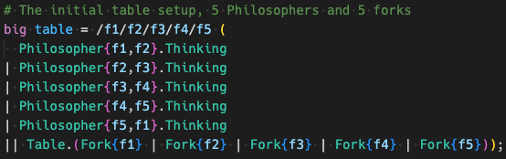

# CCS Syntax Highlighting

This extention provides syntax highlighting for [Bigrapher](hhttps://www.dcs.gla.ac.uk/~michele/bigrapher.html) documents.

## Features

Currently, we highlight the following operators:
- Assignment `=`
- Parallel `||`
- Merging `|`
- Nesting `.`
- Hiding and  `/`

Additionally:
- Control Definition
- Bigraph Definition
- Reaction Rule Definition
- BRS Block
- Datatypes (`string`, `int`, `float`)
- Parameterization (`fun`) 

## Known Issues

Keep in mind that this is work in progress, so there might be bugs or unexpected behavior.